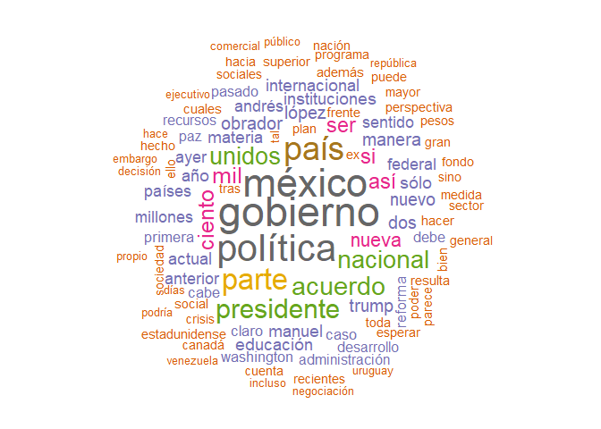
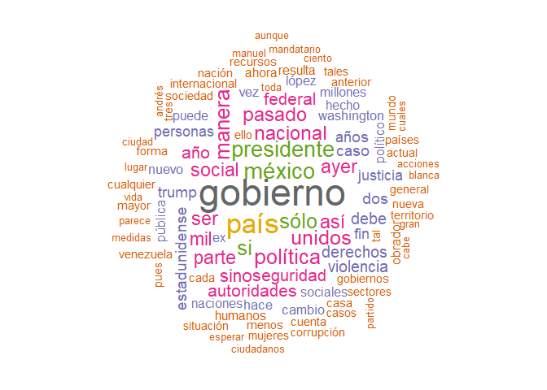
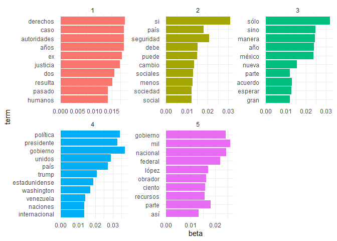
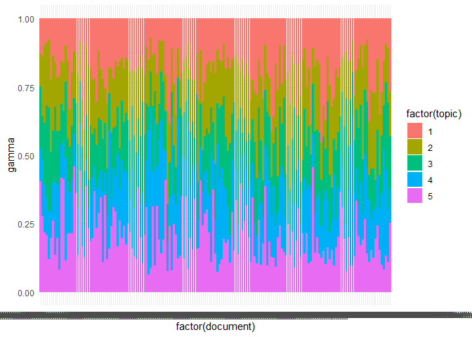
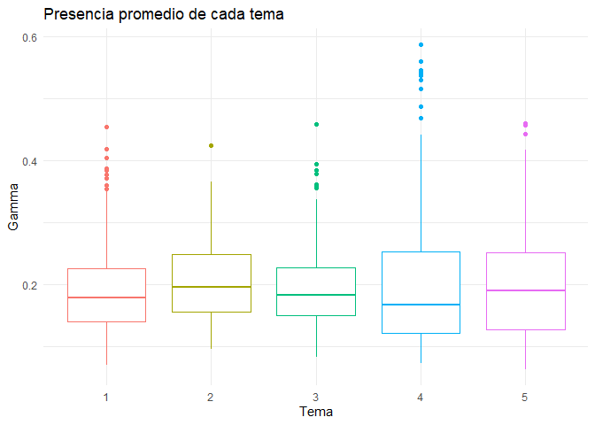

Las editoriales de *La Jornada* durante el gobierno de López Obrador
================
Santiago Valenzuela Bernal

  - [Construcción de la matriz de
    documentos](#construcción-de-la-matriz-de-documentos)
      - [1. Sentimiento (polaridad) de cada uno de los
        documentos](#sentimiento-polaridad-de-cada-uno-de-los-documentos)
      - [2. ¿Qué documento es el más
        negativo/positivo?](#qué-documento-es-el-más-negativopositivo)
      - [3. Nubes de palabras](#nubes-de-palabras)
  - [Detección de temas](#detección-de-temas)
      - [4. Detección de temas con el método
        LDA](#detección-de-temas-con-el-método-lda)
      - [5. Palabras más frecuentes en cada uno de los temas usando la
        matriz
        beta](#palabras-más-frecuentes-en-cada-uno-de-los-temas-usando-la-matriz-beta)
  - [Conclusiones](#conclusiones)

<p align="justify">

El pasado 1 de diciembre Andrés Manuel López Obrador (AMLO) tomó
posesión como presidente de México, convirtiéndose así en el primer
presidente de izquierda de la historia democrática de dicho país.

</p>

<p align="justify">

*La Jornada* ha sido, desde su fundación en los años ochenta, el
principal periódico de izquierdas de México. ¿Cuál ha sido su línea
editorial durante estos meses? ¿Ha sido crítica ante el nuevo gobierno?
¿O, por el contrario, ha seguido la agenda gubernamental? El siguiente
trabajo es una primera aproximación a este tema.

</p>

# Construcción de la matriz de documentos

## 1\. Sentimiento (polaridad) de cada uno de los documentos

Lo primero que debemos hacer es obtener las editoriales del diario *La
Jornada*. Limitaremos nuestro análisis a las editoriales publicadas
entre el 1 de diciembre de 2018 y el 20 de mayo de 2019.

Cargamos las librerías necesarias

``` r
require(stringr)
require(tidyverse)
require(lubridate)
require(tidytext)
library(rvest)
library(quanteda)
library(wordcloud)
library(topicmodels)
```

Dado que las URLs de las editoriales siguen el formato
<https://www.jornada.com.mx/AAAA/MM/DD/edito#>, podemos generar un
listado de las URLs de todas las editoriales publicadas en este periodo
con el siguiente código

``` r
url_base <-"https://www.jornada.com.mx/"
fechas <- seq(ymd('2018-12-01'),ymd('2019-05-20'),by='days')#Generamos el listado de fechas
fechas <- gsub("-","/",fechas) #Sustituimos los guiones por barras
urls_editoriales <- paste(url_base, fechas, "/edito#", sep ="") #Para cada fecha, generamos una URL
```

Posteriormente, descargamos las editoriales con las siguientes líneas:

``` r
# obtener_editoriales <- function(url){
#   x_path <- '//*[@id="article-text"]'
#   tryCatch(
#   url %>%
#     as.character() %>%
#     read_html() %>%
#     html_nodes(xpath = x_path) %>%
#     html_text() %>%
#     str_replace_all("[\r\n]" , ""),
#   error = function(e){NA}
#   )
# }
# 
# editoriales <- sapply(urls_editoriales,obtener_editoriales)

#Guardamos las editoriales para no hacer el scrap cada vez que ejecutamos el script
#save(editoriales,file = "editoriales.RData")
```

Ya que tenemos el texto de las editoriales, procedemos a construir el
*Document-feature matrix* (DFM) con términos que aparezcan en al menos
diez documentos.

``` r
corpus_lj <- corpus(editoriales)

#DFM de las editoriales
dfm_lj <- dfm(corpus_lj,
              remove_punct=TRUE,
              remove_numbers = TRUE,
              remove=stopwords(language="es"))

#Recortamos el DFM para que incluya únicamente los términos que aparezcan
#en al menos 10 documentos
dfm_lj <-dfm_trim(dfm_lj, min_docfreq = 10)

#Quitamos las filas vacías para evitar errores posteriormente
rowTotals <- apply(dfm_lj , 1, sum)
dfm_lj   <- dfm_lj[rowTotals> 0, ]
```

Antes de analizar la polaridad de las editoriales, necesitamos
clasificar las palabras en negativas y positivas. Para ello, podemos
utilizar el diccionario del proyecto
[AFINN](https://rpubs.com/jboscomendoza/analisis_sentimientos_lexico_afinn)
de Juan Bosco
Mendoza.

``` r
afinn <- read.csv("lexico_afinn.en.es.csv", stringsAsFactors = F, fileEncoding = "latin1")
```

Separamos las palabras en positivas y negativas:

``` r
pos.words <- afinn$Palabra[afinn$Puntuacion>0]
neg.words <- afinn$Palabra[afinn$Puntuacion<0]
```

Creamos un diccionario con la lista de las palabras que hemos
clasificado previamente como positivas y negativas, y construimos un
*DFM* con nuestro *corpus* al que aplicaremos dicho diccionario.

``` r
mydict <- dictionary(list(negative = neg.words,
                          positive = pos.words))

#DFM del diccionario
dfm_lj_dict <- dfm(corpus_lj,
              remove_punct=TRUE,
              remove_numbers = TRUE,
              remove=stopwords(language="es"),
              dictionary = mydict)

#Nos quedamos únicamente con aquellos términos que aparezcan en al menos 10 documentos
dfm_lj_dict <- dfm_lj_dict %>%
  dfm_trim(min_docfreq = 10)
```

Agregamos la polaridad como variable a nuestro corpus con las siguientes
líneas:

``` r
docvars(corpus_lj, "Polaridad") <- as.numeric(dfm_lj_dict[,2])-as.numeric(dfm_lj_dict[,1])
knitr::kable(head(summary(corpus_lj)) )
```

| Text                                           | Types | Tokens | Sentences | Polaridad |
| :--------------------------------------------- | ----: | -----: | --------: | --------: |
| <https://www.jornada.com.mx/2018/12/01/edito#> |   310 |    605 |         7 |       \-5 |
| <https://www.jornada.com.mx/2018/12/02/edito#> |   345 |    722 |         6 |       \-8 |
| <https://www.jornada.com.mx/2018/12/03/edito#> |   314 |    584 |         6 |      \-11 |
| <https://www.jornada.com.mx/2018/12/04/edito#> |   324 |    634 |         8 |       \-6 |
| <https://www.jornada.com.mx/2018/12/05/edito#> |   318 |    614 |         8 |       \-1 |
| <https://www.jornada.com.mx/2018/12/06/edito#> |   327 |    671 |        10 |         7 |

Y, finalmente, clasificamos los documentos como positivos y negativos

``` r
positivos <- corpus_subset(corpus_lj, Polaridad > 0)
negativos <- corpus_subset(corpus_lj, Polaridad < 0)
```

## 2\. ¿Qué documento es el más negativo/positivo?

La editorial más positiva es la del 13 de enero de 2019, en la que se
comenta el nombramiento de Juan José Gómez Camacho como embajador de
México en Canadá y las posibilidades que ofrece la profundización de
los lazos de dicho país para México. Posiblemente, el resaltar las
(supuestas o reales) coincidencias entre los ejecutivos de ambos países,
además del tono optimista sobre el futuro de los dos países
norteamericanos con el que cierra el artículo hayan hecho que sea este
el documento más
positivo.

``` r
knitr::kable(texts(corpus_subset(corpus_lj, Polaridad== max(Polaridad))))
```

|                                                | x                                                                                                                                                                                                                                                                                                                                                                                                                                                                                                                                                                                                                                                                                                                                                                                                                                                                                                                                                                                                                                                                                                                                                                                                                                                                                                                                                                                                                                                                                                                                                                                                                                                                                                                                                                                                                                                                                                                                                                                                                                                                                                                                                                                                                                                                                                                                                                                                                                                                                                                                                                                                                                                                                                                                                                                                                                  |
| ---------------------------------------------- | :--------------------------------------------------------------------------------------------------------------------------------------------------------------------------------------------------------------------------------------------------------------------------------------------------------------------------------------------------------------------------------------------------------------------------------------------------------------------------------------------------------------------------------------------------------------------------------------------------------------------------------------------------------------------------------------------------------------------------------------------------------------------------------------------------------------------------------------------------------------------------------------------------------------------------------------------------------------------------------------------------------------------------------------------------------------------------------------------------------------------------------------------------------------------------------------------------------------------------------------------------------------------------------------------------------------------------------------------------------------------------------------------------------------------------------------------------------------------------------------------------------------------------------------------------------------------------------------------------------------------------------------------------------------------------------------------------------------------------------------------------------------------------------------------------------------------------------------------------------------------------------------------------------------------------------------------------------------------------------------------------------------------------------------------------------------------------------------------------------------------------------------------------------------------------------------------------------------------------------------------------------------------------------------------------------------------------------------------------------------------------------------------------------------------------------------------------------------------------------------------------------------------------------------------------------------------------------------------------------------------------------------------------------------------------------------------------------------------------------------------------------------------------------------------------------------------------------- |
| <https://www.jornada.com.mx/2019/01/13/edito#> | Separados -o unidos, según se mire- por el territorio de la primera potencia mundial, México y Canadá son auténticos vecinos distantes. Ambos comparten la misma región geográfica y una extensa contigüidad con Estados Unidos; pero en materia de intercambios (comercial, económico, cultural) las posibilidades por explorar siguen siendo mucho mayores que los nexos que han logrado establecer.En ese sentido va la afirmación del nuevo embajador de nuestro país en suelo canadiense, Juan José Gómez Camacho, cuando dice que la prioridad en el desempeño de su cargo será fortalecer todos los lados del triángulo Estados Unidos-Canadá-México, poniendo especial énfasis en la relación entre estas dos últimas naciones. Si bien ese suele ser el tono de todos los representantes de un país en el exterior, (porque el estrechamiento de lazos es inherente a la diplomacia) en este caso hay un elemento que juega en favor del acercamiento entre los dos socios minoritarios del acuerdo trilateral que remplaza al Tratado de Libre Comercio de América del Norte: el hecho de que los mandatarios de México, Andrés Manuel López Obrador, y de Canadá, Justin Trudeau, tienen parecidas visiones en torno a los temas sociales, laborales y de diversidad e inclusión.El argumento es muy atendible, porque aunque en el fondo se trata de conseguir inversiones, prerrogativas y ventajas recíprocas de orden industrial, comercial y financiero, ello aumenta, en paralelo, las posibilidades de conocimiento mutuo y movilidad interpersonal. El año pasado alrededor de dos millones 200 mil canadienses visitaron México (contra menos de 400 mil compatriotas que viajaron a Canadá), cifras bastante modestas si se considera que los dos países se ubican en la misma zona del mundo.Lo anterior probablemente se deba, como apunta el embajador Gómez Camacho, a la fuerza de gravedad que EU ejerce como polo de atracción, pese a que, según la Asociación Global de Viajes de Negocios, desde la asunción al poder de Donald Trump las visitas de extranjeros a ese país muestran un persistente declive.Desde una óptica puramente económica, la actual coyuntura parece favorable para intensificar los vínculos entre México y Canadá. El intercambio bilateral de bienes tiende a ascender, complementando las actividades que tienen lugar en el contexto del acuerdo trilateral, y los inversores canadienses se ven atraídos por el tamaño del mercado mexicano y las perspectivas de ampliar la red de tratados comerciales de nuestro país. Pero de explorarse más a fondo las presuntas coincidencias de ambos gobiernos en lo social y sociocultural, la relación podría ampliarse en estos terrenos y los dos países dejar de ser desconocidos que comparten un mismo subcontinente. |

Por otro lado, la editorial más negativa durante este periodo fue la del
15 de mayo, en la cual *La Jornada* conmemora el segundo aniversario de
la muerte de su corresponsal Javier Valdez y exige a las autoridades que
se haga justicia en los diversos casos de periodistas asesinados. Es
evidente el porqué un tema tan funesto sea elegido como el tema más
negativo.

``` r
knitr::kable(texts(corpus_subset(corpus_lj, Polaridad == min(Polaridad))))
```

|                                                | x                                                                                                                                                                                                                                                                                                                                                                                                                                                                                                                                                                                                                                                                                                                                                                                                                                                                                                                                                                                                                                                                                                                                                                                                                                                                                                                                                                                                                                                                                                                                                                                                                                                                                                                                                                                                                                                                                                                                                                                                                                                                                                                                                                                                                                                                                                                                                                                                                                                                                                                                                                                                                                                                                                                                                                                                                                                                                                                                                                                                                                                                                                                                                                                                                                                                                                                                                                                                                                                                                                                                                                                                                                                                                                                                    |
| ---------------------------------------------- | :----------------------------------------------------------------------------------------------------------------------------------------------------------------------------------------------------------------------------------------------------------------------------------------------------------------------------------------------------------------------------------------------------------------------------------------------------------------------------------------------------------------------------------------------------------------------------------------------------------------------------------------------------------------------------------------------------------------------------------------------------------------------------------------------------------------------------------------------------------------------------------------------------------------------------------------------------------------------------------------------------------------------------------------------------------------------------------------------------------------------------------------------------------------------------------------------------------------------------------------------------------------------------------------------------------------------------------------------------------------------------------------------------------------------------------------------------------------------------------------------------------------------------------------------------------------------------------------------------------------------------------------------------------------------------------------------------------------------------------------------------------------------------------------------------------------------------------------------------------------------------------------------------------------------------------------------------------------------------------------------------------------------------------------------------------------------------------------------------------------------------------------------------------------------------------------------------------------------------------------------------------------------------------------------------------------------------------------------------------------------------------------------------------------------------------------------------------------------------------------------------------------------------------------------------------------------------------------------------------------------------------------------------------------------------------------------------------------------------------------------------------------------------------------------------------------------------------------------------------------------------------------------------------------------------------------------------------------------------------------------------------------------------------------------------------------------------------------------------------------------------------------------------------------------------------------------------------------------------------------------------------------------------------------------------------------------------------------------------------------------------------------------------------------------------------------------------------------------------------------------------------------------------------------------------------------------------------------------------------------------------------------------------------------------------------------------------------------------------------- |
| <https://www.jornada.com.mx/2019/05/15/edito#> | Se cumplen hoy dos años del asesinato del periodista Javier Valdez Cárdenas, corresponsal de este diario en Sinaloa y autor de varios libros sobre el narcotráfico y la violencia delictiva. El crimen, perpetrado en 2017 en su natal Culiacán, fue claramente motivado por el afán de acallarlo. Siete semanas antes, en Chihuahua, había sido ultimada a tiros Miroslava Breach Velducea, también informadora y colaboradora de La Jornada, que se distinguió por su cobertura de la corrupción, la delincuencia organizada y la descomposición social en esa entidad.Además de la entrega apasionada al oficio y la excelencia profesional con que se desempeñaron, hasta convertirse, ambos, en puntos de referencia del acontecer de sus respectivos estados y de los fenómenos políticos y sociales del norte del país, tanto Miroslava como Javier fueron trabajadores de la verdad y generaron, por ello, malestares e incomodidades en el tejido de complicidades que es, por principio, indispensable para el surgimiento y desarrollo de la delincuencia organizada. El propio sinaloense lo expresó en un tuit premonitorio el 25 de marzo de 2017, 20 días antes de su asesinato, en el que hacía alusión a una amenaza que había recibido su colega de Chihuahua: A Miroslava la mataron por lengua larga. Que nos maten a todos, si esa es la condena de muerte por reportear este infierno. No al silencio.En estos dos años las investigaciones en torno de los homicidios de nuestros compañeros han avanzado lento y mal. En Chihuahua hay sospechosos que ni siquiera han sido llamados a declarar en torno a la muerte de Breach Velducea, y en Sinaloa no deja de ampliarse el universo de los posibles vinculados al crimen de Valdez Cárdenas. Ayer mismo, la Fiscalía Especializada para la Atención de Delitos cometidos contra la Libertad de Expresión (Feadle) anunció que dentro de la estructura criminal del cártel de Sinaloa hay más involucrados en el asesinato del 15 de mayo, además de los dos presuntos autores materiales que se encuentran ya detenidos.Ricardo Sánchez Pozo, titular de esa instancia de procuración, dijo que un número no determinado de copartícipes sirvieron de enlace para dar la orden al grupo ejecutor, además de que se desconoce, hasta ahora, al o los autores intelectuales del homicidio.Respecto de Miroslava, el pasado 23 de marzo, en el segundo aniversario de su muerte, y ante la inacción del gobierno que encabeza Javier Corral Jurado, se elevó un clamor de exigencia a las autoridades federales para que se proceda a la captura de todos los involucrados en el crimen y en especial de los autores intelectuales y se exigió a ambos niveles de autoridad una postura firme frente a los grupos criminales que operan en el estado y que por décadas han causado la descomposición social de Chihuahua.Entre aquel nefasto primer semestre de 2017 y la actualidad muchos periodistas han sido asesinados; cuando se cometieron las ejecuciones de Miroslava y de Javier, el país llevaba ya un elevado número de informadores muertos por desarrollar su oficio. Así como la impunidad en la cadena de casos previos facilitó los asesinatos de nuestros compañeros, la impunidad que ha prevalecido ante sus muertes ha hecho posible que sigan cayendo periodistas y activistas sociales. Por eso es fundamental cortar esa cadena catastrófica y exasperante, y emprender el esclarecimiento pleno de esos y de todos los homicidios cometidos a lo largo y ancho del país. Ninguna transformación social profunda puede llevarse a cabo sin periodismo, y el ejercicio de este oficio no puede ser realizado por periodistas muertos. |

## 3\. Nubes de palabras

Obtenemos la *wordcloud* de los términos positivos.“Gobierno” es la
palabra que más se repite, junto con “México” y “política”, lo que nos
indica los temas del que tratan las editoriales. “País” y “nacional” son
también algunos de los términos que más se repiten, lo que nos indicaría
que las editoriales positivas son aquellas que hablan sobre la política
a nivel nacional.

``` r
#positivos
textplot_wordcloud(dfm(positivos,
                       remove=stopwords(language="es"),
                       remove_punct=TRUE),
                   max_words=100, random_order= F, color=brewer.pal(8,"Dark2"))
```

<!-- -->

En cuanto a los términos negativos, obtenemos la siguiente nube de
palabras. Se repite de nuevo la palabra “gobierno” como la de mayor
peso; lo que nos indica que la mayor parte de las editoriales negativas
siguen tratando del gobierno o sus acciones; vemos sin embargo, que aquí
aparecen palabras como “seguridad”, “derechos” y “violencia”, que
estaban ausentes en la nube de palabras anterior.

``` r
textplot_wordcloud(dfm(negativos,
                       remove=stopwords(language="es"),
                       remove_punct=TRUE),
                   max_words=100, random_order= F, color=brewer.pal(8,"Dark2"))
```

<!-- -->

# Detección de temas

## 4\. Detección de temas con el método LDA

Continuamos usando nuestro *DFM* para la detección de temas. Estimamos
los cinco temas con el siguiente código:

``` r
K <- 5
lda <- LDA(dfm_lj, k = K, method = "Gibbs", control = list(verbose = 25L, seed = 123, 
    burnin = 100, iter = 500))
```

    ## K = 5; V = 730; M = 169
    ## Sampling 600 iterations!
    ## Iteration 25 ...
    ## Iteration 50 ...
    ## Iteration 75 ...
    ## Iteration 100 ...
    ## Iteration 125 ...
    ## Iteration 150 ...
    ## Iteration 175 ...
    ## Iteration 200 ...
    ## Iteration 225 ...
    ## Iteration 250 ...
    ## Iteration 275 ...
    ## Iteration 300 ...
    ## Iteration 325 ...
    ## Iteration 350 ...
    ## Iteration 375 ...
    ## Iteration 400 ...
    ## Iteration 425 ...
    ## Iteration 450 ...
    ## Iteration 475 ...
    ## Iteration 500 ...
    ## Iteration 525 ...
    ## Iteration 550 ...
    ## Iteration 575 ...
    ## Iteration 600 ...
    ## Gibbs sampling completed!

Y revisamos cuales son los temas encontrados

``` r
terms <- get_terms(lda, 15)
knitr::kable(terms)
```

| Topic 1     | Topic 2   | Topic 3  | Topic 4       | Topic 5        |
| :---------- | :-------- | :------- | :------------ | :------------- |
| derechos    | si        | sólo     | gobierno      | mil            |
| caso        | seguridad | sino     | política      | nacional       |
| años        | país      | manera   | presidente    | gobierno       |
| autoridades | debe      | año      | unidos        | federal        |
| ex          | puede     | méxico   | país          | parte          |
| justicia    | cambio    | nueva    | trump         | lópez          |
| dos         | sociales  | acuerdo  | estadunidense | obrador        |
| resulta     | menos     | esperar  | washington    | ciento         |
| pasado      | social    | parte    | venezuela     | recursos       |
| humanos     | sociedad  | gran     | naciones      | así            |
| violencia   | méxico    | sectores | internacional | millones       |
| corrupción  | ser       | pasado   | cualquier     | andrés         |
| mandatario  | mayor     | personas | gobiernos     | social         |
| tres        | situación | incluso  | casa          | toda           |
| vez         | tal       | medio    | nación        | administración |

## 5\. Palabras más frecuentes en cada uno de los temas usando la matriz beta

Obtenemos los primeros diez temas en cada tema con el siguiente código y
los visualizamos:

``` r
dm_topics <- tidytext::tidy(lda, matrix = "beta")

dm_top_terms <- dm_topics %>% dplyr::group_by(topic) %>% dplyr::top_n(10, beta) %>% 
    dplyr::ungroup() %>% dplyr::arrange(topic, -beta)

dm_top_terms %>%
  dplyr::mutate(term = reorder(term, beta)) %>%
  ggplot(aes(term, beta, 
    fill = factor(topic))) +
  geom_col(show.legend = FALSE) +
  facet_wrap(~topic, scales = "free") + 
    coord_flip() +
  theme_minimal()
```

<!-- -->
Podemos intuir que el tema 1, al mencionar términos como “derechos”,
“justicia”, “violencia” y “corrupción” trata sobre el impacto que la
grave situación de inseguridad ha tenido en los derechos humanos en
México.

El segundo tema habla sobre temas sociales. “Social”, “Sociales” y
“sociedad” nos indican esto. El tercer tema debe tratar sobre
distintos “acuerdos” que deberían hacerse entre diversos “sectores”. Las
palabras “sólo”, “sino”, “gran” nos hace ver que este es un tema
altamente prescriptivo.

El cuarto tema, con términos como “Trump”, “Washington” o “Venezuela”
trata, claramente, de política exterior.

Finalmente, el quinto tema, con términos como “recursos”, “millones”,
“administración” debe ser sobre la política hacendaria del presidente
López Obrador, el cual también aparece entre los principales términos de
este tema.

\#\#6. Uso de la matriz gamma para visualizar el tópico con mayor peso
de media

Por último, podemos utilizar la matriz gamma para visualizar el peso de
cada uno de los temas en los documentos.

``` r
dm_editorials <- tidytext::tidy(lda, matrix = "gamma")
ggplot(dm_editorials,
       aes(x = factor(document),
           y = gamma, fill = factor(topic))) +
    geom_bar(stat = "identity") +
  theme_minimal()
```

<!-- -->

Sin embargo, si queremos visualizar el tema que, de media, aparece más
veces, usamos las siguientes líneas.

``` r
promedios_temas <-dm_editorials %>%
  group_by(topic) %>%
  summarise(avg = mean(gamma))

knitr::kable(promedios_temas)
```

| topic |       avg |
| ----: | --------: |
|     1 | 0.1925633 |
|     2 | 0.2057442 |
|     3 | 0.1957604 |
|     4 | 0.2028905 |
|     5 | 0.2030416 |

Como podemos ver, el tópico que de media aparece con mayor peso es el
segundo, sobre temas sociales. No obstante, no hay gran diferencia en la
presencia de cada tema

``` r
dm_editorials %>%
  ggplot(aes(x=as_factor(topic),y=gamma, color=as_factor(topic)))+
  geom_boxplot() +
  theme_minimal() +
  theme(legend.position="none") +
  labs(title="Presencia promedio de cada tema",
       x="Tema",
       y = "Gamma")
```

<!-- -->

# Conclusiones

<p align="justify">

El presente trabajo intentó esclarecer la línea editorial del diario *La
Jornada* frente al gobierno de López Obrador. Si bien pudimos comprobar
que en las editoriales de *La Jornada* el gobierno y el mismo López
Obrador tienen un papel central, los análisis realizados hasta el
momento no nos permiten dar una respuesta en un sentido u otro. Una
posible opción para análisis posteriores sería el uso de bigramas para
realizar el análisis de textos; de igual manera, es posible que, si
usáramos alguna métrica de calidad y la optimizáramos para encontrar el
número óptimo de temas, el análisis resultante fuera más preciso. Sea
cual sea el caso, hemos conocido un poco mejor la línea editorial de *La
Jornada*.

</p>
